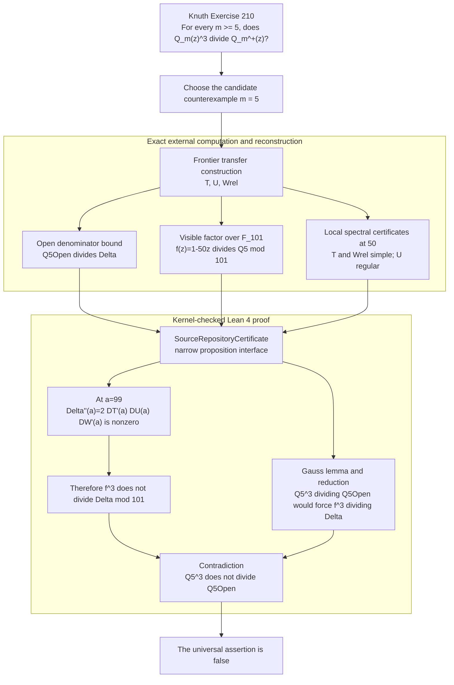

# Width-5 counterexample to a knight's-tour denominator conjecture

A reproducible, computer-assisted **disproof** of a conjecture about knight's-tour
generating functions, with a concrete counterexample at board width **m = 5**, assisted primarily by GPT-5.5 Pro.

## At a glance

| Level | Statement | Status |
|---|---|---|
| **Knuth's original question** | For every `m >= 5`, is `Q_m(z)^3` a divisor of `Q_m^+(z)`? | Disproved by one counterexample. |
| **Certified width-5 result** | `Q_5(z)^3` does **not** divide `Q_5^+(z)` in `Q[z]`. | Exact C++ verification plus the mathematical argument in [PROOF.md](PROOF.md). |
| **Current Lean theorem** | The same nondivisibility follows from the proposition-level claims exported by the source certificates. | Kernel-checked by Lean 4; `lake build` passes. |
| **Fully integrated target** | Derive those certificate claims and the transfer-matrix semantics inside Lean, starting from the knight graph. | Not yet formalized; intentionally separated into later phases. |

The exact Lean endpoint is:

```lean
theorem SourceRepositoryCertificate.counterexample
    {Q5 Q5Open Delta : ℤ[X]}
    (c : SourceRepositoryCertificate Q5 Q5Open Delta) :
    ¬(Q5.map (Int.castRingHom ℚ)) ^ 3 ∣
      Q5Open.map (Int.castRingHom ℚ)
```

Thus the present Lean development is a complete formalization of the
**algebraic proof kernel**, with an explicit computational trust boundary. It
is not presented as a kernel-only derivation of the frontier-state matrices or
of the binary certificates. See [LEAN4.md](LEAN4.md) and
[FORMALIZATION_DECISION.md](FORMALIZATION_DECISION.md).

## Original problem, computation, and formal proof



The boundary in the diagram is deliberate. The existing C++ programs parse
and check the large sparse matrices and fixed certificates. Lean receives only
the mathematical propositions needed by the small final proof.

## Source proof versus the shorter Lean proof

The source proof establishes that the multiplicity of `1 - 50z` in the
open-side transfer determinant is exactly

```text
1 + 0 + 1 = 2.
```

For the contradiction, Lean only needs to rule out multiplicity at least three.
It therefore uses the following shorter derivative argument.

Let `a = 99 = 50^{-1}` in `F_101`, and let `D_T`, `D_U`, and `D_W` be the three
diagonal determinant sectors. The certificate interface supplies

```text
D_T(a) = 0,   D_T'(a) != 0,
D_U(a) != 0,
D_W(a) = 0,   D_W'(a) != 0.
```

Then

```text
(D_T D_U D_W)''(a) = 2 D_T'(a) D_U(a) D_W'(a) != 0.
```

Every polynomial divisible by `(1 - 50z)^3` has zero second derivative at
`a`. Hence `(1 - 50z)^3` cannot divide the transfer determinant. This avoids a
separate valuation or Jordan-normal-form layer in the final Lean theorem while
using the same certified local spectral facts.

| Aspect | Source presentation | Lean presentation |
|---|---|---|
| Required conclusion | Multiplicity is exactly `2`. | Cubic divisibility is impossible. |
| Local input | Simple in `T`, absent in `U`, simple in `Wrel`. | The corresponding simple-root/nonroot propositions. |
| Final method | Algebraic multiplicity and Jordan-block argument. | Nonvanishing of the second formal derivative. |
| Benefit | Stronger spectral statement. | Smaller and more robust formal proof. |

## Formalization status by proof obligation

Legend: **Lean** = kernel-checked; **external** = deterministic exact C++ check;
**interface** = imported into Lean as a proposition; **future** = not yet
formalized end to end.

| Proof obligation | Evidence in this repository | Status |
|---|---|---|
| The frontier states and transitions enumerate the intended closed/open knight tours. | Generator invariants, independent small-board counts, and `make sanity`. | **External / future Lean semantics** |
| The generated matrices and reflection blocks equal the released data. | Byte-for-byte `make regen-check` and `make hashes`. | **External** |
| The open transfer is upper triangular by the degree of `infinity`. | Mathematical argument in [PROOF.md](PROOF.md); generic three-block determinant theorem in `BlockTriangular.lean`. | **Generic part Lean; concrete instantiation interface** |
| A reduced scalar denominator divides an exhibited transfer determinant. | `reduced_denominator_dvd_of_cross_mul` in `AlgebraicCore.lean`. | **Lean** |
| `1 - 50z` divides the reduced closed denominator modulo `101`. | `verify_visible.cpp` and the visible polynomial/eigenvector files. | **External -> interface** |
| Eigenvalue `50` is simple in `Trel`, absent in `U`, and simple in `Wrel`. | Six exact Wiedemann/Berlekamp--Massey checks, permutation similarity, and the border certificate. | **External -> interface** |
| An injective bordered map gives a one-dimensional kernel and no generalized chain. | `Border.lean`. | **Lean** |
| Two simple sectors and one regular sector rule out a cubic factor. | `DerivativeMultiplicity.lean`. | **Lean** |
| Divisibility descends from `Q[X]` to primitive polynomials in `Z[X]`. | Gauss-lemma bridge in `AlgebraicCore.lean`. | **Lean** |
| Reduction modulo `101` transports the hypothetical cubic divisibility. | `modular_nondivisibility` and `PaperTheorem.lean`. | **Lean** |
| The width-5 counterexample follows from the exported certificate propositions. | `SourceRepositoryCertificate.counterexample`. | **Lean** |
| Construct a `SourceRepositoryCertificate` by parsing and proving soundness of every binary certificate inside Lean. | Planned certificate-reader phase. | **Future** |
| Derive the entire theorem directly from the knight graph inside Lean. | Requires the formal frontier-state invariant and transfer/count correspondence. | **Future** |

## Correspondence with `PROOF.md`

| Source proof section | Mathematical role | Lean module / current boundary |
|---|---|---|
| §1 Transfer decomposition | `Q_5^+` divides the product of the three sector determinants. | Generic determinant and reduced-denominator lemmas are in Lean; the concrete transfer identification is an interface claim. |
| §2 State-space data | Sizes, SCCs, terminal reachability, and `Wrel ≃ Trel`. | Checked externally by regeneration and extraction tools. |
| §3 Visible factor | `1 - 50z` divides `Q_5 mod 101`. | Checked externally; represented by `visible_factor`. |
| §4 Rank and multiplicity | Simple/regular behavior at eigenvalue `50`. | Generic border lemma is in Lean; large rank certificates remain external. |
| §5 Contradiction | Gauss lemma, reduction, and the final divisibility contradiction. | Fully formalized in `AlgebraicCore.lean`, `DerivativeMultiplicity.lean`, and `PaperTheorem.lean`. |
| §6 Sanity checks | Audits startup/terminal conventions against independent counts. | External cross-check; deliberately not used as a substitute for the denominator proof. |

## The problem


For the knight's graph on an `m x n` board, let `S_{m,n}` count **closed** tours
(Hamiltonian cycles) and `S^+_{m,n}` count **open** tours (Hamiltonian paths). For
fixed `m` these are rational generating functions in `z` (the variable marking the
number of columns `n`):

```text
S_m(z)   = sum_{n>=0} S_{m,n}   z^n = P_m(z)   / Q_m(z),
S_m^+(z) = sum_{n>=0} S^+_{m,n} z^n = P_m^+(z) / Q_m^+(z).
```

> **Exercise 210** (Donald E. Knuth, [*The Art of Computer Programming, Volume 4, Fascicle 8A*](https://www-cs-faculty.stanford.edu/~knuth/fasc8a.pdf), rated HM46):
>
> *Prove or disprove that `Q_m^+(z)` is a multiple of `Q_m(z)^3` when `m >= 5`.*

**This repository disproves it.** At `m = 5`, `Q_5^+(z)` is **not** divisible by
`Q_5(z)^3`, so the universal statement is false.

## How the certified proof works

The polynomials `Q_5, Q_5^+` have degree in the thousands, so the proof never
computes them directly. Instead it works modulo the prime **101** and tracks a
single factor, `1 - 50z`:

1. **Transfer decomposition.** The open-tour transfer matrix, built with an
   auxiliary vertex `infinity` adjacent to every square, is block-triangular
   `B = [[T,X,Z],[0,U,Y],[0,0,W]]` ordered by the degree of `infinity` (`0 -> 1 -> 2`).
   `T` is the ordinary closed-tour transfer; after both `infinity` edges are placed,
   `W` contracts to another copy of `T`. Hence the reduced open denominator divides
   `det(I - zT) det(I - zU) det(I - zWrel)` over the integers.
2. **Visible factor.** Over `F_101`, `1 - 50z` divides the reduced closed
   denominator `Q_5`, certified by an explicit `50`-eigenvector that is both
   reachable from the terminal vector and visible from the start state.
3. **Multiplicity bound.** The algebraic multiplicity of eigenvalue `50` in
   `T (+) U (+) Wrel` is exactly `2 = 1 + 0 + 1`, certified by exact
   Wiedemann/Berlekamp--Massey nonsingularity checks and a bordered-matrix
   argument.
4. **Contradiction.** If `Q_5^3 | Q_5^+`, reduction modulo `101` would force
   `(1 - 50z)^3` to divide the transfer determinant, contradicting the bound above.

The full source argument is in [PROOF.md](PROOF.md).

## Verification and cross-check matrix

The checks are complementary. In particular, agreement of initial coefficients
is an audit of the transfer conventions, not a proof about reduced denominator
divisibility.

| Command | What it checks | Independence / role |
|---|---|---|
| `make sanity` | Held--Karp count on `5 x 4` and initial closed/open transfer counts. | Independent combinatorial audit of startup, endpoint, and terminal conventions. |
| `make regen-check` | Regenerates `T`, `U`, `W`, SCCs, reflection blocks, and permutation data byte for byte. | Audits that released matrix data comes from the checked generator. |
| `make visible-check` | Recomputes the polynomially generated eigenvector and verifies visibility of eigenvalue `50`. | Establishes the factor `1 - 50z` in the genuine closed scalar denominator. |
| `make rank-check` | Recomputes all Krylov moments and reruns Berlekamp--Massey for six certificates. | Exact local nonsingularity/simple-root evidence; stored moments are not trusted. |
| `make hashes` | Checks every released source, matrix, and certificate against `SHA256SUMS`. | File-integrity audit. |
| `lake build` | Type-checks every Lean theorem and the final conditional counterexample theorem. | Kernel verification of the algebraic proof layer. |
| Lean CI placeholder scan | Rejects `sorry`, `admit`, and locally declared `axiom`s. | Ensures the repository does not close proof obligations by local placeholders. |

### Reproduce all checks

```sh
make all
make sanity
make regen-check
make visible-check
OMP_NUM_THREADS=8 make rank-check
make hashes
lake update
lake build
```

The six independent rank checks can instead be run in parallel:

```sh
JOBS=6 OMP_NUM_THREADS=1 scripts/verify_ranks_parallel.sh
```

## Requirements

- a 64-bit little-endian machine;
- a C++17 compiler;
- GNU Make;
- OpenMP is optional and only parallelizes the Krylov verification; the code has a
  serial fallback. On Apple clang, build with `make OMPFLAGS= all`;
- Lean 4.31.0 and mathlib `v4.31.0` for the formal proof layer.

The C++ verifier uses no external mathematical library.

## Expected data and count checks

Expected full-graph SHA-256 values, also checked by `make regen-check`:

```text
f6f3c08995a607bf6217fcfe6d432a9c712b8962a0b785fe2ff03b56d808055e  data/T5.bin
847d20bc46ab8c060bfc00c49e26ab84e64d8bd4b0fe36a7915a9834be2d16ca  data/U5.bin
37c75a7aea19bd1dd885ec304c36ea165c02947d2575de829798dc03024ef5d7  data/W5.bin
```

The independent and transfer counts include:

| `n` | closed `S_(5,n)` | open `S^+_(5,n)` |
|---:|---:|---:|
| 4 | 0 | 82 |
| 5 | 0 | 864 |
| 6 | 8 | 18,784 |
| 8 | 44,202 | 18,061,054 |
| 10 | 13,311,268 | 7,886,117,822 |
| 12 | 4,557,702,762 | 3,611,823,644,006 |

The `5 x 4` Held--Karp program obtains 164 directed Hamiltonian paths, hence 82
after identifying reversal.

## Regenerate the certificates

The checked-in certificates use seed `1`. Generation uses randomness only to
find the data; verification of the fixed data is deterministic and exact.

```sh
make certs-regenerate
sha256sum -c SHA256SUMS
```

## Repository layout

| Path | Purpose |
|---|---|
| `PROOF.md` | Mathematical argument and exact certificate interpretation |
| `LEAN4.md` | Lean theorem, module map, and trust boundary |
| `FORMALIZATION_DECISION.md` | Formalization suitability assessment and phased plan |
| `KnuthFasc8AEx210/AlgebraicCore.lean` | Divisibility, reduced denominators, and Gauss lemma |
| `KnuthFasc8AEx210/DerivativeMultiplicity.lean` | Second-derivative cubic obstruction |
| `KnuthFasc8AEx210/Border.lean` | General bordered-map kernel/no-chain lemma |
| `KnuthFasc8AEx210/BlockTriangular.lean` | Three-block determinant factorization |
| `KnuthFasc8AEx210/PaperTheorem.lean` | Reduction modulo `101` and width-5 theorem |
| `KnuthFasc8AEx210/CertificateInterfaces.lean` | Generic proposition-level certificate interface |
| `KnuthFasc8AEx210/SourceRepository.lean` | Mapping of source-verifier claims to the Lean theorem |
| `src/transfer_generator.cpp` | Frontier transfer generator for `T`, `U`, and `W` |
| `src/extract_blocks.cpp` | Reflection blocks, SCC extraction, and `Wrel = Trel` check |
| `src/sanity_counts.cpp` | Scalar closed/open transfer counts |
| `src/bruteforce_5x4.cpp` | Independent Held--Karp count on the `5 x 4` board |
| `src/verify_visible.cpp` | Visible-factor certificate checker |
| `src/verify_rank_cert.cpp` | Exact rank-certificate checker |
| `data/`, `results/`, `SHA256SUMS` | Matrices, certificates, captured outputs, and hashes |

## Binary formats

All integer fields are little-endian.

- `KMC201` -- sparse CSR matrix modulo 101, followed by canonical state labels;
- `KMV101` -- eigenvector and nonzero pivot;
- `KMP101` -- polynomial used for the visible factor;
- `KMW2CERT` -- rank-certificate header, Krylov moments, and BM connection polynomial.

`SHA256SUMS` covers every source, matrix, and certificate in the release.

## Reproducibility notes

The generator is fully deterministic: hash-table iteration order is not allowed
to affect a saved transition list. Consequently, `make regen-check` rebuilds
every matrix byte for byte from source.

The rank verifier reconstructs the random preconditioners and probe vectors
from a recorded seed, recomputes all `2N + 32` moments from the sparse matrix,
reruns Berlekamp--Massey, and only then compares against the stored data. A
passing verification therefore does not depend on trusting precomputed moments.
